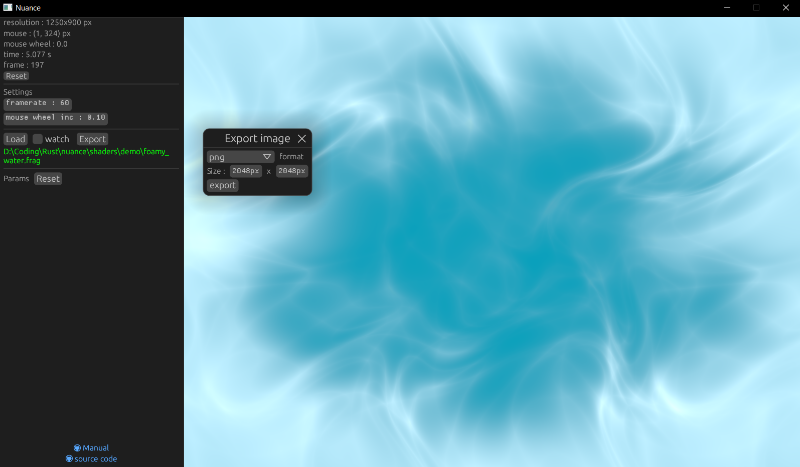

# Nuance


A tool to run your shaders on the gpu.


*Loaded with example shader : `shaders/demo/foamy_water.frag` Made by k-mouse (
2016-11-23) https://www.shadertoy.com/view/llcXW7*

## Installation

Install with cargo:

```shell
$ cargo install --locked nuance
```

See [Development](#Development) when building from source.

Or download a prebuilt binary from the [Release](https://github.com/Gui-Yom/nuance/releases) page.
Prebuilt binaries are currently available for Windows (x86_64-pc-windows-msvc) and Linux
(x86_64-unknown-linux-gnu).

## Usage

Run it as is or `nuance -H` to force using the best gpu on your machine. By default, nuance selects
the less power-hungry gpu.

## Shaders

Nuance allows you tu run a custom fragment shader. You can also use a shader already compiled to
SpirV directly given it was compiled with the Nuance header.

See the complete list of changes from GLSL in [the manual](MANUAL.md).

### Custom parameters

You can specify additional parameters to your shader using a special interface block. When compiling
your shader, parameters will be parsed from the source code to generate sliders and other
appropriate UI elements. The shader source will then be transpiled to correct GLSL to be compiled.
Example :

```glsl
// layout(params) indicates that this block is the special one to be parsed.
layout(params) uniform Params {
// layout(min, max, init) to modify each parameters settings
    layout(min = 0, max = 100, init = 1) float fSlider0;
    layout(min = 0, max = 20) float fSlider1;
};

void main() {
    // You can use special values like <param>.min and <param>.max, they will be replaced by the settings defined
    // in the params block
    fragColor = vec4(fSlider0 / fSlider0.max, fSlider1 / fSlider1.max, 0.0, 1.0);
}
```

#### Why this implementation for specifying parameters ?

"Hijacking" the layout qualifier allows me to use an
existing [GLSL parser](https://github.com/vtavernier/glsl-lang). It parses those qualifiers as
arbitrary identifiers which permits great flexibility.

### Examples

This repository includes some examples under `shaders/`. Some of these are not from me and are just
included here for demonstration purposes. They are the property of their respective owners.

## Development

We use `shaderc-rs` to compile GLSL shaders to spirv. It is therefore highly recommended to install
the vulkan sdk and set the `VULKAN_SDK` env var in order to find the prebuilt shaderc libraries. If
not, shaderc will download and build the vulkan libraries from source, which takes about 90% of this
entire application build time.

## TODO

Ideas and tasks I should work on in no particular order.

- Merge params uniform block with push_constant block
- Preprocessor error handling & reporting
- Complete error handling (currently crashes if something goes wrong)
- GPU hot switch (for when you need some extra gpu juice on the fly)
- Bind textures as input
- Bind buffers as output
- Sound processing (in and out)
- Save to gif or video
- Load shaders directly from [shadertoy.com](https://shadertoy.com) (need to convert globals)
- Shader editor (code editor, GLSL highlighting)
- Small standard library for GLSL shaders with common functions
- Custom additions to GLSL language built into the preprocessor for a more fluent language
- Custom parser for glsl
- Support rust-gpu shaders
